# Tactician CLI - Visual Walkthrough

This document shows how the project graph evolves as you apply tactics and complete tasks.

**Legend:**
- 🟢 Green (Stadium shape): Complete nodes
- 🔵 Blue (Rectangle): Ready nodes (can be worked on)
- 🔴 Red (Rectangle): Blocked nodes (waiting on dependencies)

---

## Step 1: Initialize Project

```bash
tactician init
```

Project initialized with empty graph.


---

## Step 2: Add Root Goal

```bash
tactician node add my_saas_app complete_product --type product --status pending
```

We've added the root goal for our SaaS application.

### Full Graph

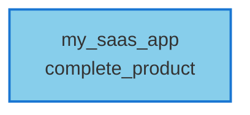

### Open Goals

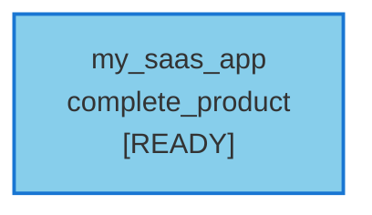

---

## Step 3: Apply `gather_requirements` Tactic

```bash
tactician apply gather_requirements
```

This tactic creates a `requirements_document` node.

### Full Graph

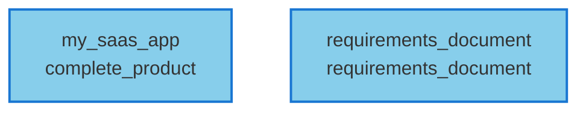

### Open Goals

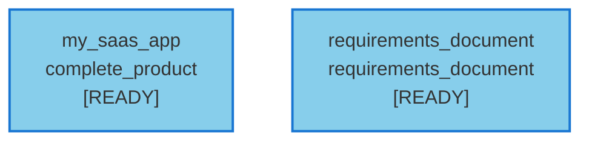

---

## Step 4: Complete Requirements Document

```bash
tactician node edit requirements_document --status complete
```

Marking the requirements document as complete unblocks dependent tasks.

### Full Graph


### Open Goals


Notice how nodes that depend on `requirements_document` are now ready (blue).

---

## Step 5: Apply `design_data_model` Tactic

```bash
tactician apply design_data_model
```

This creates a `data_model` node that depends on `requirements_document`.

### Full Graph

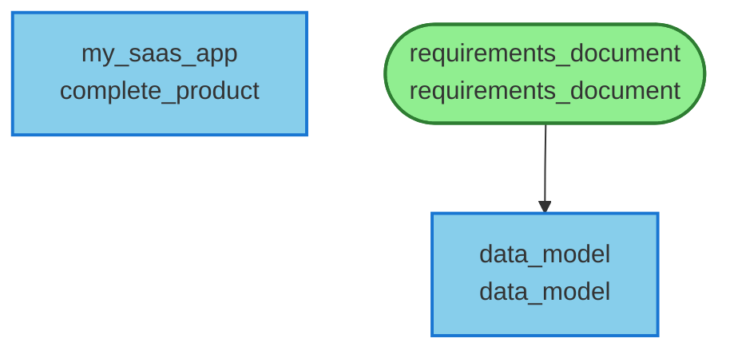

### Open Goals

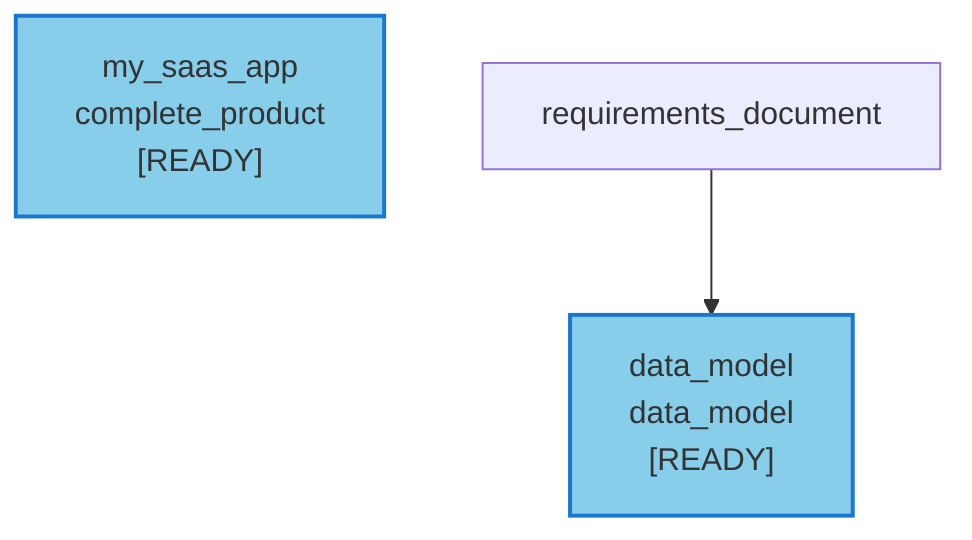

---

## Step 6: Complete Data Model

```bash
tactician node edit data_model --status complete
```

### Full Graph

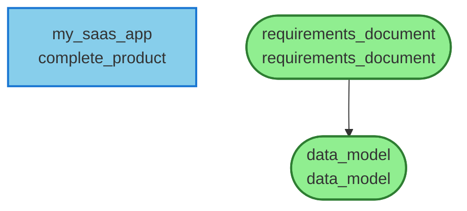

### Open Goals


---

## Step 7: Create and Complete Technical Specification

```bash
tactician apply write_technical_spec
tactician node edit technical_specification --status complete
```

### Full Graph

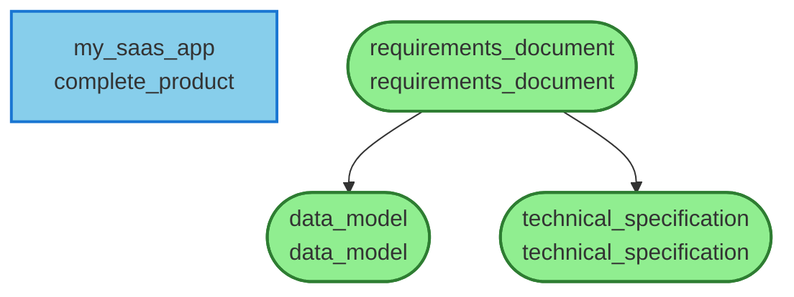

### Open Goals


---

## Step 8: Apply `design_api` Tactic

```bash
tactician apply design_api
```

This creates an `api_specification` node.

### Full Graph

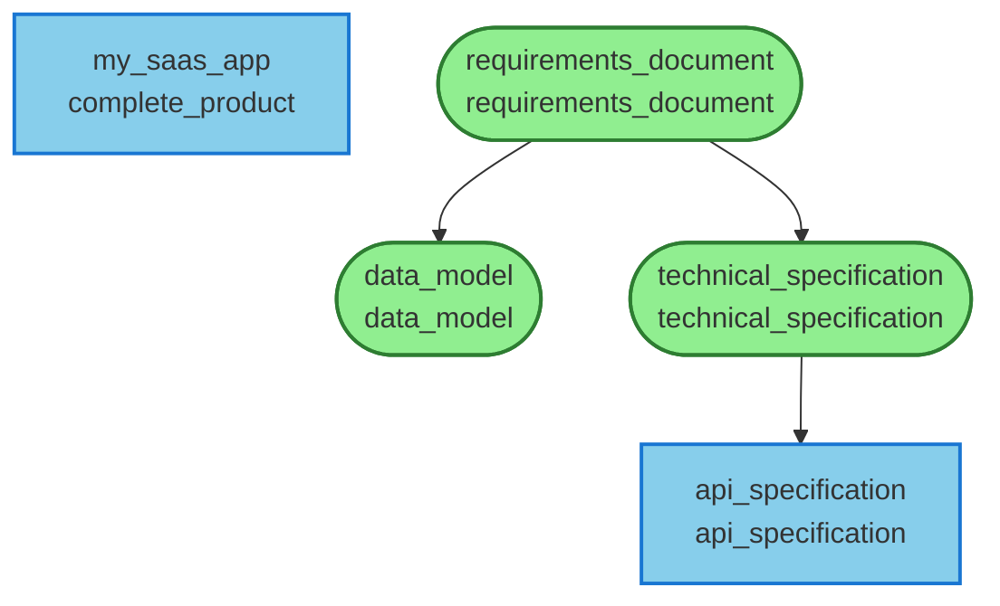

### Open Goals

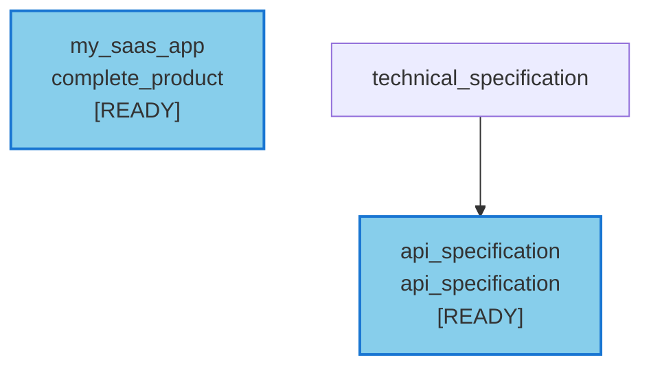

---

## Step 9: Complete API Specification

```bash
tactician node edit api_specification --status complete
```

### Full Graph

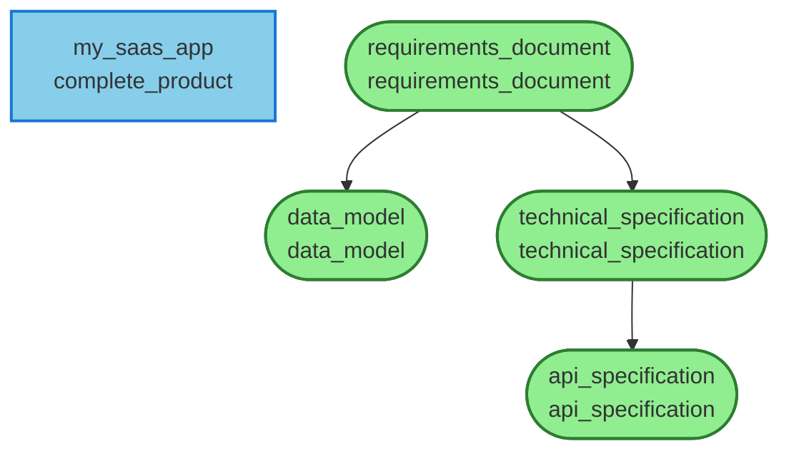

### Open Goals


---

## Step 10: Apply `implement_crud_endpoints` (Rich Tactic)

```bash
tactician apply implement_crud_endpoints
```

This is a **rich tactic** that creates 3 subtasks with dependencies:
1. `endpoints_analysis` (ready immediately)
2. `api_code` (blocked by endpoints_analysis)
3. `endpoint_tests` (blocked by api_code)

### Full Graph

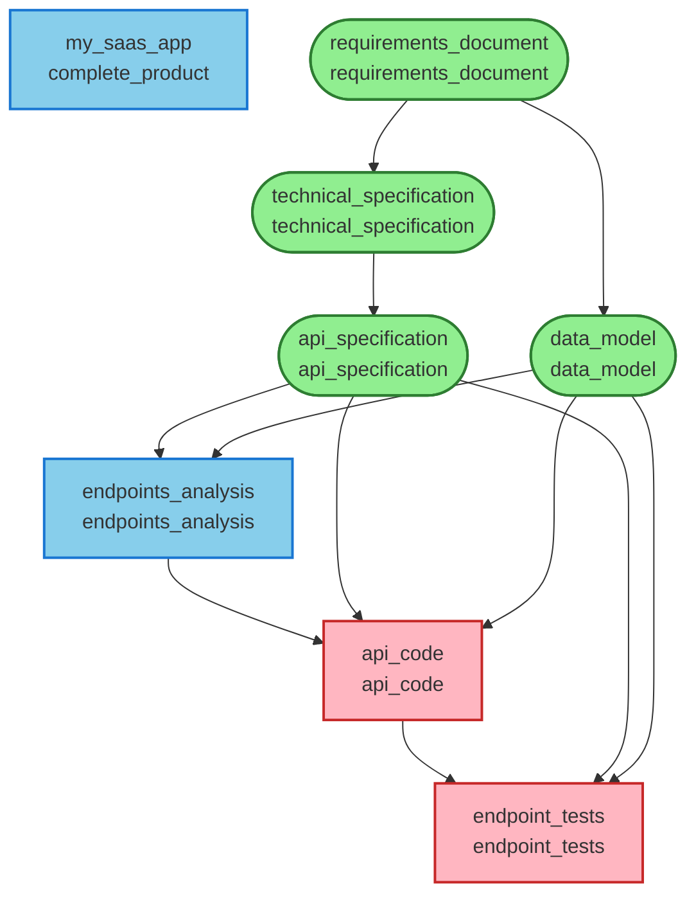

### Open Goals

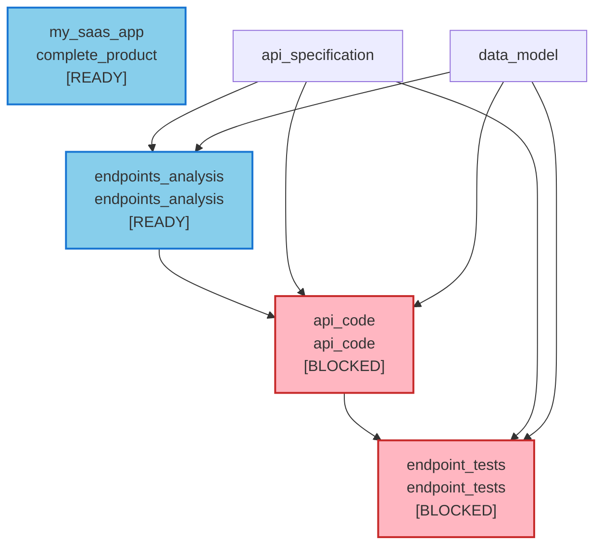

Notice the dependency chain: `endpoints_analysis` → `api_code` → `endpoint_tests`

---

## Step 11: Complete Endpoints Analysis

```bash
tactician node edit endpoints_analysis --status complete
```

Completing this unblocks `api_code`.

### Full Graph

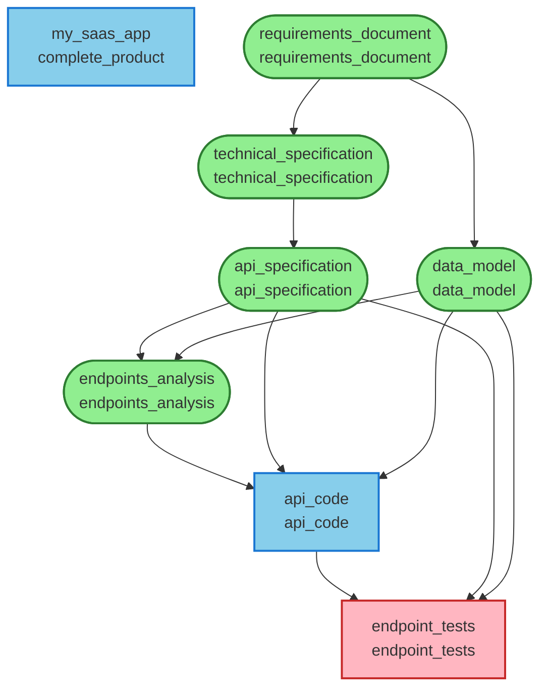

### Open Goals

```mermaid
graph TD
  my_saas_app["my_saas_app<br/>complete_product<br/>[READY]"]
  class my_saas_app ready
  api_code["api_code<br/>api_code<br/>[READY]"]
  class api_code ready
  endpoint_tests["endpoint_tests<br/>endpoint_tests<br/>[BLOCKED]"]
  class endpoint_tests blocked
  endpoints_analysis --> api_code
  api_specification --> api_code
  data_model --> api_code
  api_code --> endpoint_tests
  api_specification --> endpoint_tests
  data_model --> endpoint_tests

  classDef ready fill:#87CEEB,stroke:#1976D2,stroke-width:2px
  classDef blocked fill:#FFB6C1,stroke:#C62828,stroke-width:2px

```

---

## Step 12: Complete API Code

```bash
tactician node edit api_code --status complete
```

Completing this unblocks `endpoint_tests`.

### Full Graph

```mermaid
graph TD
  my_saas_app["my_saas_app<br/>complete_product"]
  class my_saas_app ready
  requirements_document(["requirements_document<br/>requirements_document"])
  class requirements_document complete
  data_model(["data_model<br/>data_model"])
  class data_model complete
  technical_specification(["technical_specification<br/>technical_specification"])
  class technical_specification complete
  api_specification(["api_specification<br/>api_specification"])
  class api_specification complete
  endpoints_analysis(["endpoints_analysis<br/>endpoints_analysis"])
  class endpoints_analysis complete
  api_code(["api_code<br/>api_code"])
  class api_code complete
  endpoint_tests["endpoint_tests<br/>endpoint_tests"]
  class endpoint_tests ready
  requirements_document --> data_model
  requirements_document --> technical_specification
  technical_specification --> api_specification
  endpoints_analysis --> api_code
  api_code --> endpoint_tests
  api_specification --> endpoints_analysis
  api_specification --> api_code
  api_specification --> endpoint_tests
  data_model --> endpoints_analysis
  data_model --> api_code
  data_model --> endpoint_tests

  classDef complete fill:#90EE90,stroke:#2E7D32,stroke-width:2px
  classDef ready fill:#87CEEB,stroke:#1976D2,stroke-width:2px
  classDef blocked fill:#FFB6C1,stroke:#C62828,stroke-width:2px

```

### Open Goals

```mermaid
graph TD
  my_saas_app["my_saas_app<br/>complete_product<br/>[READY]"]
  class my_saas_app ready
  endpoint_tests["endpoint_tests<br/>endpoint_tests<br/>[READY]"]
  class endpoint_tests ready
  api_code --> endpoint_tests
  api_specification --> endpoint_tests
  data_model --> endpoint_tests

  classDef ready fill:#87CEEB,stroke:#1976D2,stroke-width:2px
  classDef blocked fill:#FFB6C1,stroke:#C62828,stroke-width:2px

```

---

## Step 13: Complete Endpoint Tests

```bash
tactician node edit endpoint_tests --status complete
```

All subtasks of the `implement_crud_endpoints` tactic are now complete!

### Full Graph

```mermaid
graph TD
  my_saas_app["my_saas_app<br/>complete_product"]
  class my_saas_app ready
  requirements_document(["requirements_document<br/>requirements_document"])
  class requirements_document complete
  data_model(["data_model<br/>data_model"])
  class data_model complete
  technical_specification(["technical_specification<br/>technical_specification"])
  class technical_specification complete
  api_specification(["api_specification<br/>api_specification"])
  class api_specification complete
  endpoints_analysis(["endpoints_analysis<br/>endpoints_analysis"])
  class endpoints_analysis complete
  api_code(["api_code<br/>api_code"])
  class api_code complete
  endpoint_tests(["endpoint_tests<br/>endpoint_tests"])
  class endpoint_tests complete
  requirements_document --> data_model
  requirements_document --> technical_specification
  technical_specification --> api_specification
  endpoints_analysis --> api_code
  api_code --> endpoint_tests
  api_specification --> endpoints_analysis
  api_specification --> api_code
  api_specification --> endpoint_tests
  data_model --> endpoints_analysis
  data_model --> api_code
  data_model --> endpoint_tests

  classDef complete fill:#90EE90,stroke:#2E7D32,stroke-width:2px
  classDef ready fill:#87CEEB,stroke:#1976D2,stroke-width:2px
  classDef blocked fill:#FFB6C1,stroke:#C62828,stroke-width:2px

```

### Open Goals

```mermaid
graph TD
  my_saas_app["my_saas_app<br/>complete_product<br/>[READY]"]
  class my_saas_app ready

  classDef ready fill:#87CEEB,stroke:#1976D2,stroke-width:2px
  classDef blocked fill:#FFB6C1,stroke:#C62828,stroke-width:2px

```

---

## Summary

This walkthrough demonstrated:

1. **Initialization**: Starting with an empty project
2. **Adding Goals**: Creating the root goal
3. **Applying Tactics**: Using tactics to create nodes
4. **Completing Tasks**: Marking nodes as complete
5. **Dependency Propagation**: How completing nodes unblocks dependents
6. **Rich Tactics**: Complex tactics with multiple subtasks and dependencies

The graph visualization clearly shows:
- **Green nodes (stadium shape)**: Completed tasks
- **Blue nodes (rectangles)**: Ready to work on
- **Red nodes (rectangles)**: Blocked by dependencies

The Mermaid diagrams update at each step, showing the evolution of your project graph.

